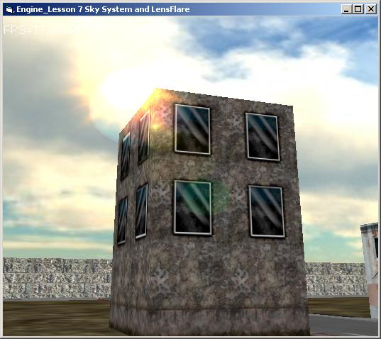



## Making a 3D Engine in VB with DirectX 8\.1 Lesson 8 Adding collision detection and frustum Culling

### Description

Hi people welcome to Making a 3D Engine in VB with DirectX 8.1 Lesson 8 Adding collision detection and frustum Culling.

In this lesson we have added new code for computing object visibility before rendering, so we render only visible objects. In addition this time we have added a foundation for collision detection with accurate collision response;When player collides with a polygon, he slides over the polygon's plane.

So good coding

Leave comments and feedbacks,now vote if you like this 3D Engine programming tutorial.

Take care

Polaris
 
### More Info
 

             |
---                |---
**Submitted On**   |2006-07-21 02:08:56
**By**             |[polaris](https://github.com/Planet-Source-Code/PSCIndex/blob/master/ByAuthor/polaris.md)
**Level**          |Intermediate
**User Rating**    |4.7 (14 globes from 3 users)
**Compatibility**  |VB 5\.0, VB 6\.0
**Category**       |[DirectX](https://github.com/Planet-Source-Code/PSCIndex/blob/master/ByCategory/directx__1-44.md)
**World**          |[Visual Basic](https://github.com/Planet-Source-Code/PSCIndex/blob/master/ByWorld/visual-basic.md)
**Archive File**   |[Making\_a\_32008097212006\.zip](https://github.com/Planet-Source-Code/polaris-making-a-3d-engine-in-vb-with-directx-8-1-lesson-8-adding-collision-detection-and-__1-66040/archive/master.zip)

